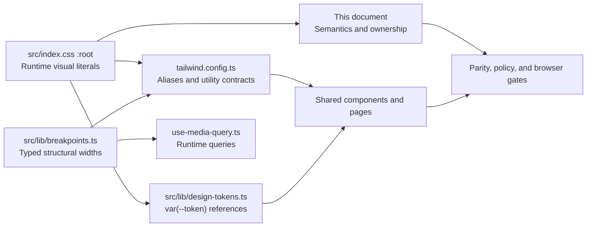
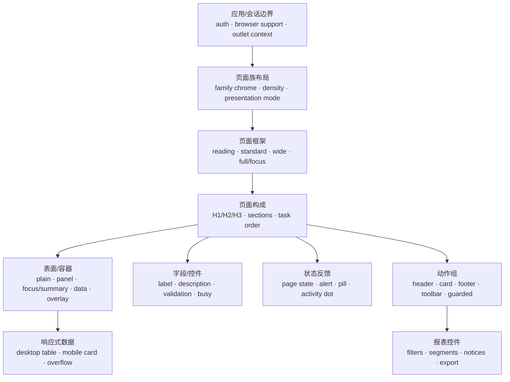

# Frontend Design Contract V2

This document is the canonical V2 contract for the frontend in
`frontend/src/`. V2 converges consumers around the existing Academic Editorial
foundation; it is not a second theme or component library. The product is an
internal assessment desk: warm-paper surfaces, black-ink typography, restrained
rules, compact controls, and readable density for real exam and administration
work.

This is a design contract, not a test report. A command or browser check is
only considered evidence after it has actually run; current command results,
environment details, and remaining risks belong in `docs/handoff.md`.

## Scope and compatibility boundary

The visual system covers four intentional composition families:

- **Candidate Calm** for ordinary candidate learning, exam, result, review,
  and profile journeys.
- **Admin Workbench** for dense operational, configuration, import, and report
  work.
- **Exam Focus** for an active formal exam or practice question.
- **Auth Canvas** is the chrome-free identity surface for candidate and
  administrator sign-in/registration.

The contexts share tokens and local primitives but intentionally do not share
chrome or density. The following are locked compatibility boundaries: route
paths and entry IDs, navigation destinations and order, authentication/session
and authorization behavior, API clients and response/enum contracts, forms and
validation, exam snapshots, answer persistence, scoring, submission, retake
and invitation behavior, imports, reports, and return destinations. Presentation
and copy may be rewritten only when those boundaries remain unchanged.

This change does not add backend endpoints, alter persistence, or introduce a
new framework, design library, font service, queue, LMS, or anti-cheat suite.

## Source ownership and drift control

Every governed value has one owner. The dependency direction is:



### V2 single-owner presentation graph

Each presentation concern has one owner and one downstream direction. A page
may compose these owners, but it may not silently claim a second width, surface,
field, status, action, report, or responsive-data contract.



| Owner                                                                                    | Owns                                                                                                         | Explicitly does not own                                                         |
| ---------------------------------------------------------------------------------------- | ------------------------------------------------------------------------------------------------------------ | ------------------------------------------------------------------------------- |
| Application/session boundary (`CandidateLayout`, `AdminLayout`, protected/browser gates) | auth/session checks, browser support, outlet context, presentation-mode selection                            | page width, local density, page copy, or surface styling                        |
| Family chrome (`TopNav`, `AdminSideRail`, mobile sheets, Auth Canvas, `ExamFocusMode`)   | family navigation, chrome, density, and focus-vs-ordinary shell choice                                       | a second page frame, route/API behavior, or hidden duplicate navigation         |
| Page frame (`PageShell`)                                                                 | `reading`, `standard`, `wide`, and `full/focus` intent widths, page padding, block rhythm, family density    | card borders, form fields, status semantics, or route-specific `max-w-*` values |
| Page composition (`PageHeader`, `PageSection`, `PageState`, `PageActions`)               | one H1, ordered headings, optional meaningful context, semantic sections, task order, action reflow          | new global tokens, API fetching, or a competing surface owner                   |
| Surfaces (`PageSection`, `Card`, data/overlay primitives)                                | plain, panel, focus/summary, data, and overlay containment: background, border, radius, padding, elevation   | async copy, action alignment, or nested duplicate containment                   |
| Fields and controls (`Field`, `Input`, `Textarea`, native `Select`, `Button`)            | label/description/error association, values, focus, disabled, pending, invalid, and success semantics        | business validation rules, request timing, or page-specific state words         |
| Statuses (`PageState`, `Alert`, `StatusPill`, activity/status dot)                       | loading, empty, stale, error, pending, saved, submitted, and recovery meaning                                | mutation ownership, action routing, or color-only meaning                       |
| Actions (`PageActions`, shared `Button`, guarded action groups)                          | primary/secondary/destructive alignment, busy/pressed state, target size, and mobile reflow                  | API semantics, save-vs-submit meaning, or report filters                        |
| Report controls (shared report toolbar)                                                  | filter/segment/notice/export order and responsive reflow                                                     | report dimensions, query parameters, or table data ownership                    |
| Responsive data (shared table/card representation)                                       | canonical labels, density, row actions, long-content wrapping, and overflow behavior across table/card views | source data, endpoint shape, or a second visual vocabulary                      |

### Ownership rules

- `src/index.css :root` owns runtime colors, fonts, type scale, line height,
  spacing, radii, shadows, focus, motion, layering, and named decorative
  treatments. It is the only runtime literal source.
- `tailwind.config.ts` exposes product aliases and consumes the CSS variables.
  Shared component contracts use aliases such as `bg-canvas`, `text-ink`,
  `text-display-*`, semantic spacing, named shadows, motion, and z-layers.
- `src/lib/design-tokens.ts` preserves the `designTokens` export for runtime
  consumers. Governed values are exact `var(--token-name)` references, never a
  second raw-value mirror.
- `src/lib/breakpoints.ts` is the sole typed structural-width map. CSS custom
  properties cannot be evaluated as Tailwind media-query conditions, so this
  build-time map is the deliberate exception. Tailwind screens and runtime
  media-query helpers consume it.
- `src/components/ui/` owns reusable control semantics and state styling.
  `src/components/page/` owns ordinary page composition. Editorial, exam, and
  admin primitives own only their domain-specific semantics.
- `src/lib/pageCopy.ts` and the existing typed copy modules own user-visible
  state and action wording. Pages do not display raw API enum values.
- `src/lib/pastelPalette.ts` is the only data-derived color exception. Its
  deterministic colors are for identity avatars/chips only, never general
  surfaces, status, borders, or control states.

Do not add `hsl(var(--...))` tokens, independent font claims, external font
URLs, a second breakpoint registry, ad-hoc z-index/duration literals, or local
copies of governed colors. When a contract changes, update the owning source,
its consumers, focused parity tests, and this document in the same change.

## Runtime token reference

The following values are the current `src/index.css :root` contract. Tailwind
aliases and `designTokens` references must resolve to these names. The tables
are intentionally explicit so a visual value can be reviewed without reading
component code.

### Surfaces, ink, lines, and status

| Token               | Value                   | Meaning                       |
| ------------------- | ----------------------- | ----------------------------- |
| `--canvas`          | `#ffffff`               | Default page/control canvas   |
| `--canvas-warm`     | `#fafaf7`               | Warm paper background         |
| `--surface-card`    | `#f5f3ee`               | Bounded panel/focus surface   |
| `--surface-elev`    | `#ffffff`               | Elevated surface              |
| `--ink`             | `#111111`               | Primary text and focus ring   |
| `--ink-soft`        | `#2a2a2a`               | Hover/secondary ink           |
| `--body`            | `#374151`               | Body text                     |
| `--muted`           | `#6b7280`               | Secondary/context text        |
| `--hairline`        | `#e5e7eb`               | Default border/rule           |
| `--hairline-soft`   | `#f3f4f6`               | Low-contrast divider          |
| `--footer`          | `#0a0a0a`               | Dark rail/footer surface      |
| `--footer-soft`     | `#a1a1aa`               | Text/dividers on dark surface |
| `--success`         | `#166534`               | Confirmed/success state       |
| `--warning`         | `#b45309`               | Warning/pending attention     |
| `--error`           | `#b91c1c`               | Error/destructive state       |
| `--ink-red`         | `#b91c1c`               | Restrained editorial accent   |
| `--ink-blue`        | `#1e3a8a`               | Restrained editorial accent   |
| `--success-on-dark` | `#4ade80`               | Success text on dark surfaces |
| `--error-on-dark`   | `#fca5a5`               | Error text on dark surfaces   |
| `--overlay`         | `rgba(17, 17, 17, 0.4)` | Dialog/sheet overlay          |

### Shape and elevation

| Token              | Value                                                                 | Contract                             |
| ------------------ | --------------------------------------------------------------------- | ------------------------------------ |
| `--radius-pill`    | `9999px`                                                              | Pills, capsules, full-round controls |
| `--radius-lg`      | `16px`                                                                | Focus cards and display surfaces     |
| `--radius-md`      | `8px`                                                                 | Forms, tables, compact surfaces      |
| `--radius-sm`      | `4px`                                                                 | Small chips/badges                   |
| `--shadow-card`    | `0 1px 2px rgba(17, 17, 17, 0.04), 0 4px 12px rgba(17, 17, 17, 0.04)` | Quiet card elevation                 |
| `--shadow-pop`     | `0 8px 24px rgba(17, 17, 17, 0.08)`                                   | Notice/popover elevation             |
| `--shadow-elevate` | `0 16px 40px rgba(17, 17, 17, 0.1)`                                   | High-priority/floating elevation     |
| `--shadow-sticky`  | `0 1px 0 0 var(--hairline)`                                           | Scrolled sticky header lift          |

### Offline-safe font stacks

No font is downloaded at runtime. The platform stack is the contract and must
remain readable when the app runs on an internal or offline network.

| Role    | Runtime stack                                                                                            | Use                                           |
| ------- | -------------------------------------------------------------------------------------------------------- | --------------------------------------------- |
| Display | `"Iowan Old Style", "Palatino Linotype", "Songti SC", STSong, Georgia, "Times New Roman", serif`         | H1-H3, display values, brand wordmark         |
| Body    | `system-ui, -apple-system, BlinkMacSystemFont, "Segoe UI", "PingFang SC", "Microsoft YaHei", sans-serif` | UI, prose, forms, tables, labels              |
| Mono    | `ui-monospace, "Cascadia Mono", "SFMono-Regular", Consolas, monospace`                                   | Question ordinals, codes, tabular identifiers |

`Songti SC`, `STSong`, `PingFang SC`, and `Microsoft YaHei` are intentional
CJK fallbacks. Source Serif 4, Inter, and JetBrains Mono are not runtime
claims and must not return to governed mirrors without a separately approved
asset/offline decision.

### Typography scale

| Token                | Value  | Tailwind alias     |
| -------------------- | ------ | ------------------ |
| `--text-display-2xl` | `64px` | `text-display-2xl` |
| `--text-display-xl`  | `48px` | `text-display-xl`  |
| `--text-display-lg`  | `36px` | `text-display-lg`  |
| `--text-display-md`  | `26px` | `text-display-md`  |
| `--text-display-sm`  | `20px` | `text-display-sm`  |
| `--text-body-lg`     | `17px` | `text-body-lg`     |
| `--text-body`        | `15px` | `text-body`        |
| `--text-body-sm`     | `13px` | `text-body-sm`     |
| `--text-caption`     | `11px` | `text-caption`     |

| Line-height token       | Value  | Applies to   |
| ----------------------- | ------ | ------------ |
| `--leading-display-2xl` | `1.05` | 64px display |
| `--leading-display-xl`  | `1.08` | 48px display |
| `--leading-display-lg`  | `1.12` | 36px display |
| `--leading-display-md`  | `1.22` | 26px display |
| `--leading-display-sm`  | `1.3`  | 20px display |
| `--leading-body-lg`     | `1.7`  | 17px body    |
| `--leading-body`        | `1.7`  | 15px body    |
| `--leading-body-sm`     | `1.6`  | 13px body    |
| `--leading-caption`     | `1.4`  | 11px caption |

| Tracking token             | Value     | Use                         |
| -------------------------- | --------- | --------------------------- |
| `--tracking-display-tight` | `-0.02em` | H1-H3/display headings      |
| `--tracking-display`       | `-0.01em` | Smaller display headings    |
| `--tracking-caption`       | `0.16em`  | Captions and compact labels |

Headings use the display stack, canonical type aliases, and upright font style.
Weight, size, color, and a restrained rule provide emphasis; italic is not a
heading/status/action/question/metric/navigation treatment.

### Semantic spacing

| Token                    | Value      | Tailwind alias   |
| ------------------------ | ---------- | ---------------- |
| `--space-page-inline`    | `1.5rem`   | `page-inline`    |
| `--space-page-inline-lg` | `4rem`     | `page-inline-lg` |
| `--space-page-block`     | `2.5rem`   | `page-block`     |
| `--space-section`        | `2rem`     | `section`        |
| `--space-section-lg`     | `3rem`     | `section-lg`     |
| `--space-panel`          | `1.5rem`   | `panel`          |
| `--space-field`          | `1rem`     | `field`          |
| `--space-field-compact`  | `0.75rem`  | `field-compact`  |
| `--space-control-x`      | `0.875rem` | `control-x`      |
| `--space-control-y`      | `0.625rem` | `control-y`      |
| `--space-control-gap`    | `0.5rem`   | `control-gap`    |
| `--space-inline`         | `0.75rem`  | `inline`         |
| `--space-stack`          | `1rem`     | `stack`          |

Numeric Tailwind spacing remains acceptable for local micro-layout. Shared
page/component contracts use these semantic aliases; do not introduce new
arbitrary spacing literals for a governed pattern.

### V2 semantic presentation roles

The V2 contract names the roles that shared token and component work must
implement. Their values belong to the existing CSS root and typed breakpoint
owners; this document does not create a parallel token registry.

| Role              | Contract                                                                                                                                       |
| ----------------- | ---------------------------------------------------------------------------------------------------------------------------------------------- |
| Type and tracking | semantic display/body/caption roles and the governed heading/caption tracking roles; no page-level arbitrary type or tracking                  |
| Page frame        | `reading`, `standard`, `wide`, and `full/focus` intent widths, with family-owned density and inline padding                                    |
| Action            | shared primary/secondary/destructive alignment, busy/pressed state, and predictable mobile reflow                                              |
| Exam Focus target | option, navigation, guarded-exit, save, and submit controls expose at least `44px × 44px` CSS pixels on touch layouts                          |
| Status on surface | success, warning, error, selected, and focus use the correct on-light/on-dark treatment and never rely on color alone                          |
| Overlay viewport  | dialogs and sheets use the available dynamic viewport (`dvh` or an equivalent governed calculation), internal scrolling, and safe-area spacing |
| Elevation         | plain/panel/data surfaces stay restrained; focus/summary and overlay elevation use named roles only                                            |

These roles are compatibility-neutral presentation contracts. They cannot alter
answer values, request timing, navigation targets, API fields, or business
state.

### Focus, motion, layering, and named texture

| Token                        | Value                        |
| ---------------------------- | ---------------------------- |
| `--focus-ring-width`         | `2px`                        |
| `--focus-ring-color`         | `var(--ink)`                 |
| `--focus-ring-offset`        | `2px`                        |
| `--focus-ring-radius`        | `var(--radius-sm)`           |
| `--motion-duration-instant`  | `0ms`                        |
| `--motion-duration-fast`     | `120ms`                      |
| `--motion-duration-normal`   | `200ms`                      |
| `--motion-duration-slow`     | `280ms`                      |
| `--motion-duration-shimmer`  | `1500ms`                     |
| `--motion-ease-linear`       | `linear`                     |
| `--motion-ease-standard`     | `cubic-bezier(0.2, 0, 0, 1)` |
| `--motion-distance-rise`     | `6px`                        |
| `--motion-stagger-step`      | `40ms`                       |
| `--motion-stagger-max`       | `240ms`                      |
| `--z-background`             | `0`                          |
| `--z-content`                | `1`                          |
| `--z-sticky`                 | `20`                         |
| `--z-overlay`                | `40`                         |
| `--z-modal`                  | `50`                         |
| `--z-toast`                  | `60`                         |
| `--texture-admin-login-dot`  | `rgba(255, 255, 255, 0.08)`  |
| `--texture-admin-login-size` | `24px`                       |

`admin-login-pattern` is the named, offline-safe admin-login decoration. Do
not copy its gradient or texture into general surfaces. The paper-grain SVG
in `index.css` is a fixed decorative background, not content and not a source
of layout dimensions.

## Page families and composition matrix

Routes remain exactly those in `src/app/router.tsx`. The matrix documents the
appropriate shell, density, and attention for each route family.

| Family          | Representative routes                                                                                                                                                                                                    | Chrome                                                    | Density and composition                                                                                        | Primary attention                                                   |
| --------------- | ------------------------------------------------------------------------------------------------------------------------------------------------------------------------------------------------------------------------ | --------------------------------------------------------- | -------------------------------------------------------------------------------------------------------------- | ------------------------------------------------------------------- |
| Candidate Calm  | `/exams`, `/exams/:examId/start`, `/learning`, `/learning/:videoId`, `/profile`, `/exams/:examId/result`, `/practice/wrong-questions`                                                                                    | Candidate `TopNav`; candidate identity/actions            | `PageShell density="calm"` where ordinary list/detail; `PageHeader` + plain/panel sections + `PageState`       | Current task, result/review, or one primary action                  |
| Admin Workbench | `/admin/dashboard`, `/admin/accounts`, `/admin/questions`, `/admin/questions/import`, `/admin/exams`, `/admin/learning`, `/admin/learning/reports`, `/admin/reports/*`, `/admin/operations`, and exam-scoped admin pages | Grouped `AdminSideRail` on desktop; matching mobile sheet | `PageShell density="workbench"`; compact header, status/filter/table/action regions                            | Operational status, filters, data density, and guarded action       |
| Exam Focus      | `/exams/:examId/taking` and active `/practice`                                                                                                                                                                           | Dedicated focus controls only; no ordinary page header    | `PageShell density="focus"`; `ExamFocusMode`, `Timer`, `ExamNavigator`, progress, persistence feedback, submit | Question/options, remaining time, save/recovery, navigation, submit |
| Auth Canvas     | `/login`, `/register`, `/admin/login`                                                                                                                                                                                    | No candidate top nav, admin rail, or global footer        | Centered identity/validation surface; shared `Wordmark`, `PageHeader`, `Field`, `Alert`, and primary action    | Identity step, validation, recovery                                 |

Candidate and admin shells share tokens and primitives, not navigation
placement. Exam Focus is a specialized exception: it must not receive a
marketing hero, unrelated navigation, or an ordinary page header. Auth routes
are chrome-free even when they are rendered under a candidate layout route.
Auth Canvas uses one reading stack in portrait; in a short landscape viewport,
the identity/header region and form region become two columns so the primary
action remains reachable without introducing another page-width owner.

There is no global decorative footer in any shell. A semantic local footer is
allowed inside a result, dialog, or card only when it describes that local
content or its actions.

### Ordinary page composition

Use the shared primitives in this order unless a family exception applies:

1. `PageShell` owns page width, density, vertical rhythm, and optional
   orientation-only entry motion.
2. `PageHeader` owns one page H1, an optional meaningful context label,
   description, and page actions.
3. `PageSection` owns one semantic content surface.
4. `PageState` owns page-level loading/empty/error/attempt feedback and can
   inherit a parent surface with `surface="inherit"`.
5. `PageActions` owns wrapping/reflow of page-level actions.

Do not hand-roll another page header or add a second H1. Specialized focus
components may use their own heading structure under the documented Exam Focus
exception.

### Page-frame width roles

`PageShell` is the only ordinary-page width owner. A route selects one intent
role; it must not add a competing page-level maximum or horizontal padding.

| Role         | Intended content                                               | Family examples                 |
| ------------ | -------------------------------------------------------------- | ------------------------------- |
| `reading`    | prose, rules, review explanation, and other text-led content   | Candidate Calm, Auth Canvas     |
| `standard`   | ordinary list/detail/form work with one primary task           | Candidate Calm, Admin Workbench |
| `wide`       | tables, reports, workspaces, and multi-region operational data | Admin Workbench                 |
| `full/focus` | active questions, timers, navigators, and dynamic overlays     | Exam Focus                      |

Family layouts own the canvas and chrome. `PageShell` owns the selected role's
padding and rhythm. A page composition owns semantic order only; it cannot
recreate a width, radius, shadow, or typography role locally.

## Typography, hierarchy, and content voice

### Heading and context contract

- An ordinary route has exactly one page-level H1. H2 sections and H3 nested
  subsections follow document order; a heading is not chosen solely for size.
- H1/H2/H3 are upright and use the display aliases. No fixed-height title box
  is permitted.
- `PageHeader.eyebrow`/`context` is optional. When present it is one meaningful
  route, workflow-position, or operational-state label, rendered above and in
  the same stack as the H1. When absent or empty it contributes no DOM marker.
- Titles, descriptions, context labels, names, metrics, and navigation use
  `min-w-0`/safe wrapping (`break-words` or an equivalent governed utility)
  so CJK and long unbroken words reflow at 320px and under zoom.
- One-line enforcement belongs only to compact controls, navigation items, and
  owned action groups. Business-content links and titles remain wrappable; an
  action group reflows before its compact label is allowed to break.
- `ChapterNumber` is an upright context/ordinal primitive, not mandatory page
  decoration. Retain it only for a real sequence such as question position.
  `ExamNavigator` may use the mono type stack for compact question numbers.
- No production italic class or variant currently exists. A future quotation or
  editorial-prose treatment may introduce one only together with a named
  prose-quotation class/variant and its focused policy-test allowlist. Italic is
  not allowed on headings, status, action, question, metric, navigation,
  wordmark, or name-plate labels.

### Chinese-first glossary and English allowlist

Chinese carries the primary task meaning in headings, labels, actions, table
headers, statuses, alerts, and supporting copy. `src/lib/pageCopy.ts` is the
single reusable copy owner; pages do not interpolate API enum values or create
decorative translations. The glossary below is a semantic contract, not a
stylistic suggestion.

| Canonical term | Use it for                                                                                   | Do not substitute it with                                          |
| -------------- | -------------------------------------------------------------------------------------------- | ------------------------------------------------------------------ |
| `用户`         | the authenticated person in general learning, practice, profile, and other non-roster flows  | `应考人员` when no exam-scoped roster or authorization is involved |
| `应考人员`     | an exam-scoped participant, invitation, roster record, or formal exam authorization          | `用户` for roster labels or participant-management actions         |
| `应考名单`     | the roster imported or managed for one exam                                                  | generic “用户列表” in exam-scoped admin UI                         |
| `题库`         | the active question collection and its management surface                                    | raw question API names or English module labels                    |
| `保存答案`     | persisting the current answer; it does not finish the attempt                                | `交卷` or a generic “提交”                                         |
| `交卷`         | submitting the whole exam attempt, manually or automatically                                 | `保存答案` or “保存试卷”                                           |
| `留在考试`     | dismissing a guarded-exit warning and keeping the active attempt open                        | `返回` when the action does not leave the attempt                  |
| `离开考试`     | intentionally navigating away from the active attempt, subject to the existing warning/rules | `退出登录` or an ambiguous “关闭”                                  |
| `返回考试列表` | the existing destination after leaving or reviewing an exam                                  | a new route or a generic “返回”                                    |
| `已保存`       | confirmed persistence only                                                                   | a request-start or pending state                                   |

The save/submit distinction is behavioral: saving answers may repeat without
ending an attempt; submitting ends the attempt and can be manual or automatic.
The stay/leave distinction is navigational: `留在考试` keeps the current
workspace, while `离开考试` proceeds to the existing guarded destination.

English is allowed only when it adds product or operational meaning:

| Allowlist                | Allowed placement                                                         | Boundary                                                    |
| ------------------------ | ------------------------------------------------------------------------- | ----------------------------------------------------------- |
| `Internal Exam Platform` | the governed product wordmark/subtitle                                    | exact product name only; never a routine page eyebrow       |
| `Excel`                  | file-format guidance and import controls                                  | do not translate API state or add a decorative English pair |
| `ID`                     | a compact machine identifier when the identifier itself is the task       | prefer Chinese `编号` for ordinary table labels             |
| `OTP`                    | a verification-code implementation term where users need that distinction | never expose an API field or raw error code                 |

This allowlist is intentionally narrow. English may not be used for routine
page labels, statuses, table metadata, faux chapter markers, or all-caps
`ENGLISH · 中文` eyebrows. If a product name or stable operational term is
shown bilingually, the Chinese label remains primary and both strings name the
same concept.

Labels identify the task or state directly, stay concise, and preserve business
terminology. Question type, question position, score, save status, and exam
lifecycle language must remain semantically accurate.

## Surface containment

Every semantic group has one owner for background, border, radius, and shadow.
The hierarchy is:

1. **Canvas** — page background; never a card.
2. **Plain section** — spacing and optional rule; default grouping surface.
3. **Panel** — one bounded form, support, warning, or configuration region.
4. **Focus card** — one emphasized actionable or summary object.
5. **Table surface** — one data region containing its header, rows, responsive
   representation, and local async state.

`PageSection` retains exactly `plain | panel | card | table`:

| Variant | Owns                                      | Typical use                                                           |
| ------- | ----------------------------------------- | --------------------------------------------------------------------- |
| `plain` | Rhythm only                               | Ordinary grouped content or metric grid whose children own boundaries |
| `panel` | Rounded border, warm surface, padding     | Form/configuration/support region                                     |
| `card`  | Focus-card border, canvas, radius, shadow | One emphasized summary/action object                                  |
| `table` | One bounded data region                   | Table header, rows, empty/error, mobile cards                         |

`MetricCard`, `Card`, and `ExamFocusMode` may own a focus surface when they
represent one object. Do not place an independently bordered/card child inside
a parent focus card for the same semantic group. Loading, empty, error, and
stale feedback inherit their surrounding owner instead of creating a card
inside a card. Preserve metric values, observation time, stale semantics,
readiness, and deep links while flattening containment.

## Shared component ownership

| Component area     | Owner                                                                      | Contract                                                                                                                |
| ------------------ | -------------------------------------------------------------------------- | ----------------------------------------------------------------------------------------------------------------------- |
| Page frame         | `PageShell`                                                                | Width (`reading`, `standard`, `wide`, `full/focus`), density (`calm`, `workbench`, `focus`), rhythm, orientation motion |
| Header             | `PageHeader`                                                               | Optional meaningful context, one H1, description, responsive actions, safe wrapping                                     |
| Sections/state     | `PageSection`, `PageState`, `PageActions`                                  | Surface ownership, inherited async state, action reflow                                                                 |
| Editorial identity | `Wordmark`, `NamePlate`, `ChapterNumber`, `StatusPill`, `EmptyState`       | Upright labels, CJK-safe identity/context presentation, no decorative italic UI                                         |
| Form controls      | `Field`, `Input`, `Textarea`, native `Select`, `Button`                    | Label/description/error association and shared default, focus, disabled, pending, invalid, success states               |
| Exam focus         | `ExamFocusMode`, `ExamNavigator`, `ProgressCapsule`, `Timer`, `OptionCard` | Question semantics, ordinal context, options, timer, save/recovery, navigation, submit                                  |
| Admin metrics/data | `MetricCard`, `SimpleDataTable`, report primitives                         | Dense scan-friendly values, one surface owner, responsive table/card behavior                                           |
| Navigation         | `TopNav`, grouped `AdminSideRail`, `ExamContextNav`                        | Family-specific chrome, active semantics, keyboard reachability, existing routes only                                   |

Pages compose these owners. A page may add domain content but should not
reimplement their typography, controls, API fetch details, or state language.

## Form, control, and async-state contract

`Field` owns the visible label, description, error association, and state
attributes. `Input`, `Textarea`, and native `Select` preserve native semantics
and consume the same height, radius, spacing, typography, focus, disabled,
invalid, success, and pending contracts. Do not add a custom combobox for the
current requirements.

| State           | Required behavior                                                       |
| --------------- | ----------------------------------------------------------------------- |
| Default         | Stable border, readable value, associated label                         |
| Hover           | Restrained affordance; no layout shift                                  |
| Focus-visible   | Immediate canonical ink ring with 2px width and 2px offset              |
| Selected/active | Native selected/active semantics plus an explicit visual signal         |
| Disabled        | Native disabled behavior, unavailable affordance, no mutation           |
| Pending/loading | Mutation guard, busy semantics, visible pending copy                    |
| Invalid/error   | Associated error text and invalid semantics; color is supplemental      |
| Success         | Confirmed copy/semantic state; never inferred merely from request start |

Mutation buttons stay disabled while the mutation is pending. Native select
keyboard and mobile-picker behavior is preserved. File pickers and segmented
controls follow the same focus and state rules. Success/error meaning must not
depend on color alone.

### Canonical visible state language

Use existing typed copy/status boundaries for `pending`, `saving`, `saved`,
`stale`, `offline`, `conflict`, `error`, `submitted`, and `auto-submitted`.
The UI must distinguish “request started” from “persistence confirmed”. An
admin workspace may show last-good data with a stale/observation label while a
refresh fails; it must not silently replace valid data with an empty/error
surface. Exam Focus must distinguish answer saving, recoverable offline or
conflict feedback, manual submission, and server auto-submit. Do not expose
raw API status codes or invent a competing copy registry.

## Navigation contract

### Candidate navigation

`TopNav` is candidate-only and exposes the existing Learning, Practice, and
Exams destinations, the candidate profile/identity affordance, login/logout,
and the return-to-exam-list action where applicable. Desktop and mobile keep
the same destination order; mobile uses a Sheet and keeps logout reachable.

### Grouped admin navigation

`ADMIN_NAVIGATION_GROUPS` is the single typed model rendered by both the
desktop rail and mobile sheet. Each current primary destination appears once:

| Group | Destinations                                                                            |
| ----- | --------------------------------------------------------------------------------------- |
| 概览  | 仪表盘 (`/admin/dashboard`)                                                             |
| 内容  | 题库, 题库导入, 学习 (`/admin/questions`, `/admin/questions/import`, `/admin/learning`) |
| 考试  | 考试编排 and exam-scoped work (`/admin/exams`)                                          |
| 复盘  | 报表 (`/admin/reports/scores`, with existing report patterns)                           |
| 系统  | 用户账户, 运维 (`/admin/accounts`, `/admin/operations`)                                 |

The active item and active group are exposed visually and semantically. Rail
height/scroll behavior remains stable on desktop. The mobile sheet uses the
same order and has a labelled navigation region plus reachable logout.
Groups with multiple destinations render a visible group label. A group with
one destination keeps its label available to assistive technology but hides it
visually so the label is not repeated immediately above its only link.
Visible group labels use the caption role plus a restrained trailing rule;
navigation links remain full-row 48px targets with higher text contrast and
distinct hover, active, and focus-visible states. The desktop rail and mobile
sheet share four visual blocks: dashboard, content, exam/report, and system.
Blocks use 24px separation, visible labels use 8px separation from their link
list, and adjacent links use 4px separation. Hidden labels add no visual gap.

### Exam context navigation

`ExamContextNav` links only to existing destinations for the current exam:

- workspace: `/admin/exams/:examId`;
- configuration: `/admin/exams/:examId/edit`;
- roster and invitations: `/admin/exams/:examId/candidates` and its existing
  invitation anchor;
- result/review: existing score and wrong-question report URLs with the exam
  filter.

Monitoring remains inside the workspace. The context component must not add a
route, bypass readiness/mutation guards, duplicate the workspace advisory next
action, or infer authorization. Existing deep links and query/hash semantics
remain valid.

## Accessibility and interaction

- Preserve the single H1 and ordered H2/H3 hierarchy; document the specialized
  Exam Focus heading exception in tests rather than weakening ordinary pages.
- Every input/select/textarea has an associated label; descriptions and errors
  are joined through `aria-describedby`, with `aria-invalid`/`aria-busy` and
  field data attributes reflecting state.
- Keep `:focus-visible` rings visible, high contrast, immediate, and not
  dependent on hover or color alone. Icon-only buttons require an accessible
  label. Dialogs and Sheets require a title/description or a documented Radix
  alternative.
- Option cards expose radio/checkbox semantics according to question type.
  The question heading labels its option group and receives focus when the
  question changes.
- Mobile exam navigation uses a Sheet rather than unreachable off-screen
  controls. Fixed bottom focus controls include
  `env(safe-area-inset-bottom)` and remain reachable at 200% zoom.
- Shared Dialog content keeps a fixed inline viewport gutter, a governed local
  maximum width, dynamic-viewport maximum height, and internal scrolling. It
  must not depend on percentage horizontal translation that can drift at a
  custom dialog width.
- Formal and active-practice fixed control wrappers do not intercept the page
  outside the visible control itself. In short landscape, the mobile navigator
  control aligns to the trailing edge and the duplicate lower progress capsule
  is omitted because progress remains present in the focus header.
- Visible labels and controls must remain readable at 320px width, CJK text,
  long words, keyboard navigation, and reduced motion. No content is hidden
  solely to avoid overflow.

## Motion and responsive behavior

Only motion that communicates orientation or state is allowed. Use the named
duration/easing aliases (`instant`, `fast`, `normal`, `slow`, `shimmer`,
`linear`, `standard`) and prefer transform/opacity. `PageShell` orientation
stagger is opt-in for Candidate Calm/Auth Canvas; Admin Workbench rows and
card grids do not receive automatic decorative staggering. Sheet/Dialog
transitions and direct feedback remain allowed.

Under `prefers-reduced-motion: reduce`, stop shimmer, pulse, zoom, stagger, and
nonessential translation. Keep static loading, critical timer text/color,
selected state, and focus signals. Reduced motion must not delay dialog/sheet
access or hide save/error state.

Structural thresholds are the typed map in `src/lib/breakpoints.ts`:

| Name  | CSS width |
| ----- | --------: |
| `sm`  |   `640px` |
| `md`  |   `768px` |
| `lg`  |  `1024px` |
| `xl`  |  `1280px` |
| `2xl` |  `1536px` |

Tailwind screens and JavaScript media queries consume this map. Do not add
independent `768px`/`1024px` literals. Responsive contracts must cover:

- portrait: `320x844`, `375x812`, `414x896`, `430x932`, `768x1024`, and
  representative desktop `1280x900`;
- mobile landscape: `844x390` and `896x414`;
- 200% browser zoom and reduced-motion spot checks;
- no horizontal overflow with root clipping disabled during the assertion;
- visible focus, compact one-line action labels with parent reflow, table-to-
  card behavior, candidate top-nav transitions, admin rail/sheet transitions,
  and Exam Focus controls with safe-area spacing.

Root `overflow-x: clip`, if used, is only decorative/transition paint
protection after visible bounds have been checked; it is never the overflow
assertion itself.

## Verification and evidence gates

Static source inspection is not visual acceptance. A change is ready only when
the relevant unit/component, static, and rendered checks have actually run and
their environment/results are recorded. The standard frontend commands are:

```bash
cd frontend
npm run format:check
npm test -- --run
npm run lint
npm run build
npm run check:offline
```

For a visual-system change, also run the repository browser gate and strict
OpenSpec checks when available:

```bash
cd ..
sh ops/e2e/run-browser-gate.sh
openspec validate --all --strict --no-interactive
git diff --check
```

Rendered evidence must identify the environment, project, route/state, and
viewport. The visual-system browser project writes disposable artifacts under
the configured Playwright output directory as
`visual-system/<family>/<route>-<viewport>.png`; these artifacts are ignored
and are not product screenshots. The acceptance matrix covers:

- Auth Canvas validation and recovery;
- Candidate Calm list/detail, result, and review;
- Admin Workbench grouped navigation, dashboard/list, form/import, exam
  context, stale workspace, and report actions;
- Exam Focus question/options, timer, save/offline/conflict states, mobile
  navigator sheet, safe-area controls, and submit;
- heading order (with the documented focus exception), action reachability,
  visible focus, no covered controls, no horizontal overflow, compact label
  line-height, and no unexpected console errors.

Disposable Chromium evidence is not formal Mac, Windows, Safari, iOS, or
Android acceptance. Formal host acceptance requires the corresponding host
workflow and must be reported separately. Never write “passed” in this
document for a command or browser check that has not run.

## Change governance

When changing a governed visual contract:

1. Identify the owning CSS token, typed breakpoint, component primitive, or
   copy boundary.
2. Update the owner and its direct aliases/consumers; do not add a parallel
   literal source.
3. Add or update focused component/policy tests, including reduced motion,
   focus, CJK/long-word wrapping, state semantics, and route-family behavior
   when applicable.
4. Run the proportional static and rendered gates, then record only observed
   evidence in `docs/handoff.md`.
5. Review the final diff for backend/API/route/auth/exam-delivery scope creep.

The design review should explicitly answer: which family owns the surface,
which primitive owns the state, which source owns the value, whether the H1 and
context label are meaningful, and which viewport/evidence gate proves the
change.

## Changelog

- **2026-08-17** — Clarified grouped admin navigation with visually hidden
  single-destination labels, caption-and-rule multi-destination labels, four
  stable spacing blocks, stronger link affordances, and the task-specific
  `考试编排` destination label while preserving assistive-technology labels,
  shared desktop/mobile structure, active state, and route targets.
- **2026-08-14** — V2 converged the canonical contract around the live CSS token
  source, offline font stacks and CJK fallbacks, typed breakpoints, four page
  families, the application/session-to-responsive-data single-owner graph,
  Chinese-first glossary and narrow English allowlist, grouped admin and
  exam-context navigation, optional upright context labels, one-owner
  surfaces, shared control states, accessibility, reduced motion, safe-area /
  responsive evidence, and explicit route/API/business compatibility boundaries.
