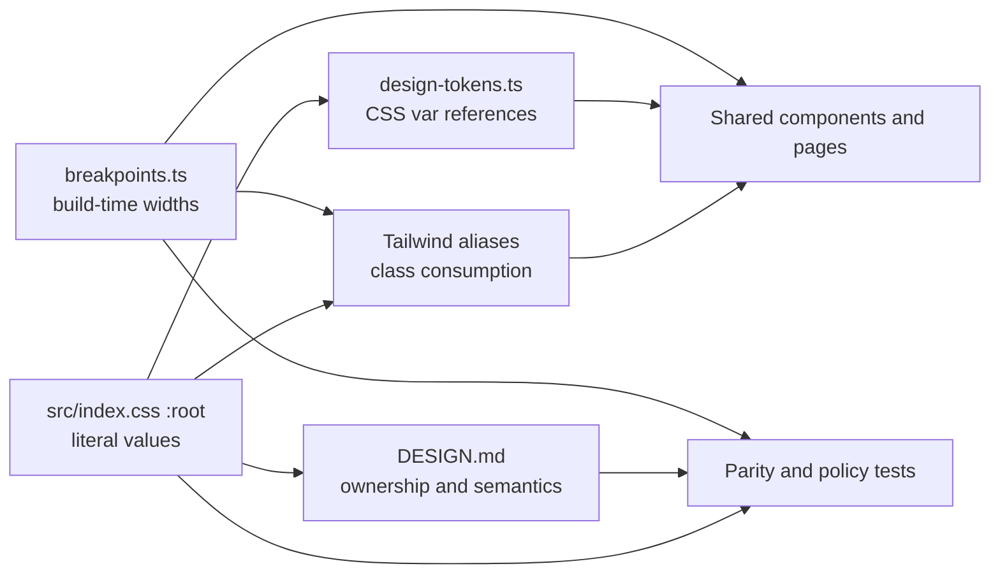

# Design: Unified Frontend Visual System

## Context

The frontend is not a greenfield redesign. It already has a recognizable Academic Editorial language, reusable page primitives, and three task-appropriate product shells:

- candidate routes use a top navigation and relatively calm list/detail pages;
- admin routes use a persistent side rail and denser operational pages;
- active exam and practice sessions use a specialized focus workspace with a question navigator, timer, persistence feedback, and mobile bottom controls.

The problem is contract drift rather than the absence of a system. `frontend/DESIGN.md`, `frontend/src/index.css`, `frontend/tailwind.config.ts`, and `frontend/src/lib/design-tokens.ts` disagree about typography and ownership. The document promises a candidate footer that the application and tests intentionally do not render. Page headers force decorative labels, several headings use italic treatment, repeated forms use locally styled native controls, and some operational views stack card surfaces inside card surfaces. Motion and responsive verification cover only part of the product.

This change treats the live frontend as the compatibility baseline. It improves the visual grammar and its verification without changing route structure, API payloads, authorization, admin aggregate semantics, or exam delivery.

### Existing constraints

- The app must remain usable on an internal or offline network; the design cannot depend on a public font or asset host.
- The existing React, Vite, Tailwind, and local shadcn-compatible primitives remain in place.
- Candidate, admin, auth, and focus contexts have different information densities and must not be forced into one universal page template.
- `admin-exam-workspace` owns workspace aggregate, privacy, freshness, polling, and advisory-action semantics.
- `exam-delivery` owns paper freezing, attempt snapshots, answer persistence, deadlines, scoring, retakes, submit, and auto-submit semantics.
- Existing working-tree changes outside this change are not part of this plan.

## Goals / Non-Goals

### Goals

- Make one verifiable source of truth govern tokens, fonts, page families, surfaces, controls, state language, motion, and responsive behavior.
- Preserve the current Academic Editorial identity while removing decorative repetition and generic dashboard-card stacking.
- Formalize Candidate Calm, Admin Workbench, Exam Focus, and Auth Canvas as explicit composition contracts.
- Make headings, controls, status feedback, navigation, and containment consistent across representative routes.
- Add rendered browser evidence at the viewports where the product is expected to remain usable.
- Leave an implementation plan that can be applied in dependency order and stopped safely after each phase.

### Non-Goals

- Rebuilding the frontend from scratch or replacing its component library.
- Adding a new runtime package, external font service, or bundled font asset.
- Changing backend endpoints, response schemas, database state, authentication, authorization, polling cadence, or route paths.
- Changing exam scoring, snapshots, answer saving, deadlines, auto-submit, invitation, import, or reporting semantics.
- Adding LMS features, complex RBAC, queues, durable offline exams, or anti-cheat monitoring.
- Treating local Chromium screenshots as formal Mac, Windows, Safari, iOS, or Android acceptance.

## Decisions

### 1. Use CSS runtime tokens plus one typed structural-breakpoint map

`frontend/src/index.css :root` will be the only place that owns literal runtime visual values. It will include named tokens for:

- surfaces, text, lines, status, overlay, and restrained editorial accents;
- display, body, and monospaced font stacks;
- semantic type sizes/line heights and page, section, control, and field spacing used by shared primitives;
- radii and elevation;
- focus ring width, color, and offset;
- motion duration and easing;
- z-index layers.

The implementation will use descriptive names rather than a second numbered theme: `--text-display-*` and `--leading-*` for the existing type scale; `--space-page-inline`, `--space-section`, `--space-field`, and `--space-control-*` for shared composition; and `--z-content`, `--z-sticky`, `--z-overlay`, `--z-modal`, and `--z-toast` for layers. Exact values are recorded in the rewritten `DESIGN.md`. Tailwind's ordinary numeric spacing utilities may continue for internal micro-layout, but any shared page/component contract changed here uses the semantic aliases; arbitrary spacing literals are not introduced.

Structural breakpoints are the deliberate build-time exception because CSS custom properties cannot drive media-query conditions. A new `frontend/src/lib/breakpoints.ts` map will own the `sm`, `md`, `lg`, and other supported width literals. `tailwind.config.ts` and JavaScript media-query consumers such as `use-media-query.ts` will import that map. Component CSS will prefer Tailwind responsive utilities instead of adding a third breakpoint registry.

The dependency direction will be:

Tailwind will continue to expose product-friendly aliases such as `bg-canvas`, `text-ink`, `text-display-*`, semantic spacing, named z-layers, and `rounded-lg`, but it will not repeat the governed raw runtime values currently present in the explicit type scale. `design-tokens.ts` will retain its exported `designTokens` key map for compatibility, but every governed value will be a `var(--token-name)` reference rather than a raw color, shadow, radius, or font literal. Tests will verify those keys and references against the CSS source. `breakpoints.ts` is separate because its values are required during Tailwind compilation and JavaScript media-query construction.

The existing system font stacks become canonical:

- display: Iowan Old Style / Palatino / Songti SC / STSong / Georgia / Times New Roman / serif;
- body: system UI / Segoe UI / PingFang SC / Microsoft YaHei / sans-serif;
- mono: platform monospace / Cascadia Mono / SFMono-Regular / Consolas / monospace.

These stacks are available without a network request and already define the live runtime behavior. Typography tests and the design contract will describe fallback behavior rather than promising Source Serif 4, Inter, or JetBrains Mono when those fonts are not loaded.

The name-derived avatar palette is a documented data-derived exception. Its literal palette may remain in one owned module if it is tested and not reused as general UI status or surface color. Decorative gradients and textures used by product surfaces must instead be named in CSS.

**Alternatives considered**

- Keep CSS and TypeScript as independent raw-value mirrors: rejected because the existing font drift demonstrates that format-only tests cannot maintain parity.
- Make TypeScript the generator for CSS: possible, but it adds a build/generation step that is unnecessary for this small frontend.
- Self-host Source Serif, Inter, and JetBrains Mono: rejected for this change because it introduces assets, licensing/weight decisions, bundle cost, and additional offline verification without improving task structure.

### 2. Preserve four composition contexts, not one universal shell

The visual system will define the following route-family matrix. Route paths remain unchanged; the matrix describes composition, density, and priority.

| Context | Representative surfaces | Chrome | Density | Primary attention |
| --- | --- | --- | --- | --- |
| Candidate Calm | learning, practice entry, exam list/start, result/review, profile | candidate `TopNav` | calm | current task and one primary action |
| Admin Workbench | dashboard, accounts, questions/import, exams, workspace, learning, reports, operations | admin grouped `SideRail` | workbench | status, filters, data, and operational action |
| Exam Focus | active formal exam and active practice question | dedicated focus chrome | focused | question, timer, save state, navigation, submit |
| Auth Canvas | login and registration completion | no product navigation | calm | identity step, validation, recovery |

Candidate and admin shells share tokens and primitives, not navigation placement. Exam Focus does not receive the ordinary `PageHeader`, a marketing hero, or unrelated navigation. Auth routes do not receive candidate/admin chrome. No shell has a global decorative footer; a semantic local footer remains allowed inside a result, dialog, or card when it describes that local content.

`PageShell` density and width variants remain the main page-frame mechanism for ordinary pages. `PageHeader`, `PageSection`, `PageState`, and `PageActions` remain the ordinary composition primitives. Specialized focus components remain specialized and consume the common foundation.

**Alternatives considered**

- Put all routes into one header/sidebar template: rejected because an active timed exam and an admin report have incompatible priorities.
- Give every page its own layout: rejected because it would preserve the current drift and make responsive acceptance unbounded.
- Add a global footer to match the old document: rejected because live code and tests consistently omit it and it adds no task value.

### 3. Make editorial hierarchy semantic and restrained

Ordinary pages will have exactly one H1. Sections use H2 and nested subsections use H3. Display headings remain upright. Emphasis uses weight, size, ink accent, or a restrained rule rather than italic heading text.

`PageHeader` will accept an optional context label. The label is rendered only when it conveys a route family, real workflow position, or operational state not already clear from the H1. It stacks with the title and does not form a detached `label-left / heading-right` composition. A page has at most one such label.

`ChapterNumber` will no longer be the mandatory implementation behind every page eyebrow. It may be retained or renamed for genuine ordinal content such as question position. Faux page numbering and decorative bilingual labels are removed from ordinary pages during migration.

Chinese remains the primary task language. English may appear for the product name, a stable operational term, or a compact synchronized label, but not merely to make every heading appear editorial. All visible state and action terms continue to use the shared copy boundary rather than raw API enums.

Italic body text is not globally prohibited. A short quotation, editorial note, or secondary prose phrase may use it when documented. H1/H2/H3, status labels, action labels, question labels, metric labels, and navigation labels stay upright.

### 4. Enforce one containment owner per semantic group

The surface hierarchy will be documented as:

1. **Canvas** — page background; never behaves like a card.
2. **Plain section** — spacing plus optional rule; default for grouping related content.
3. **Panel** — bounded form, support, warning, or configuration region.
4. **Focus card** — one emphasized actionable or summary object.
5. **Table surface** — header, rows, empty/error state, and responsive card representation as one data region.

This does not add another `PageSection` variant. `PageSection` retains `plain | panel | card | table`; its existing `card` variant carries the focus-card semantics when the section itself owns emphasis. The standalone `Card` primitive may own the same semantics for a single object, but it cannot be nested inside a `PageSection card` for the same group.

Each semantic group has one owner for background, border, radius, and shadow. A metric grid can contain individually bounded metric cards inside a plain section, or borderless metrics inside one bounded panel, but not cards inside another card. Loading, empty, error, and stale feedback inherit the surrounding surface rather than introduce a fresh card.

Implementation begins with the known `ExamWorkspacePage` metric nesting, then audits result, dashboard, import, report, and candidate-management pages. Flattening changes containment only; it does not remove data, merge unrelated actions, or reduce operational scanability.

**Alternatives considered**

- Remove all cards: rejected because focused actions and compact metrics benefit from a boundary.
- Keep nesting and reduce shadows: rejected because duplicated borders/radii still obscure hierarchy.

### 5. Standardize controls around native semantics and shared state

A shared native `Select` wrapper will join `Field`, `Input`, `Textarea`, `Button`, and existing feedback primitives. Native select behavior is preferred because the current requirements do not justify a custom combobox and its keyboard/focus complexity.

The shared control contract defines applicable states:

| State | Visual/behavior contract |
| --- | --- |
| default | stable border, readable value, associated label |
| hover | restrained affordance without layout change |
| focus-visible | canonical high-contrast ring and offset |
| active/selected | explicit state plus semantic attribute |
| disabled | unavailable appearance and native/ARIA disabling |
| loading/pending | mutation guarded, text and busy semantics preserved |
| error | error text association and invalid semantics; color is supplemental |
| success | confirmed state text/semantics; never inferred from request start |

`Field` owns label, description, error association, and state data attributes. Input, textarea, and select own their native element behavior. Mutation components own pending guards. Status content remains in shared alerts/page-state helpers rather than being encoded only into a border color.

The first migration set includes account filters, question filters, exam editing, report filters, wrong-question review, and other currently raw selects. API parameters and form schemas remain unchanged.

### 6. Group admin navigation and add exam context without routing changes

The existing destinations will be grouped in one shared model consumed by the desktop rail and mobile sheet:

| Group | Existing destination intent |
| --- | --- |
| 概览 | dashboard |
| 内容 | questions, question import, learning content |
| 考试 | exam list and exam-scoped work |
| 复盘 | reports and review surfaces |
| 系统 | accounts and operations |

The implementation may adjust exact label wording through the existing copy contract, but desktop and mobile order must match. The active destination and active group are exposed visually and semantically. The viewport-stable logout behavior remains intact.

Exam-scoped pages gain one `ExamContextNav`-style component with links to existing workspace, configuration, roster/invitations, and result/review destinations that actually exist for the current exam. Monitoring remains a workspace concern rather than a new route. The context component carries the exam identity and active destination. It does not create new routes, enable a disabled mutation, infer authorization, or duplicate the workspace advisory action.

**Alternatives considered**

- Keep eight undifferentiated primary links: rejected because the route tree and report/exam subflows are already deeper than the visible model.
- Rewrite the router into nested exam routes: rejected because information architecture can improve without expanding scope into route compatibility.
- Use a breadcrumb only: rejected because breadcrumbs describe location but do not provide the repeated exam-scoped task switcher needed across workspace, edit, and roster pages.

### 7. Preserve workspace and exam-delivery behavior while changing composition

The admin exam workspace attention order is:

1. H1 plus exam lifecycle status and server observation time;
2. stale notice when applicable;
3. exactly one advisory next-action treatment;
4. readiness and blockers;
5. permitted aggregate groups;
6. incidents/operations and existing deep links.

Loading and first-load error use `PageState`. A failed refresh with last good data keeps the aggregate, observation time, and a stale/retry notice. The UI must not invent zero counts, personally identifiable roster rows, a new `next_action`, or permission. Polling cadence and invalidation remain governed by `admin-exam-workspace`.

Exam Focus retains its existing interaction topology:

- desktop: question as primary column, navigator as secondary sticky region;
- mobile: question flow plus bottom progress/action capsule and navigation sheet;
- both: timer, save status, recovery, option semantics, progress, and submit remain reachable;
- persistence states distinguish pending, saving, saved, offline, conflict, and failure;
- submit states distinguish pending, failed, submitted, and auto-submitted.

This change can restyle or recompose these elements, but it cannot alter their request boundaries, persisted state, conflict behavior, deadlines, scoring, or snapshots.

### 8. Tokenize motion and make reduced motion complete

CSS will define a small set of named durations and easings, for example instant/fast/base and standard/emphasized easing. Exact values are chosen and documented in `frontend/DESIGN.md` during the token phase, then reused by CSS utilities and Tailwind configuration.

Motion is allowed for:

- sheet/dialog entrance and exit;
- direct hover/focus/press feedback;
- a short opt-in page entrance when it helps orientation;
- a loading indicator when static copy alone would not indicate work.

Automatic staggering is not the default for workbench rows or card grids. Continuous shimmer and timer pulse receive static reduced-motion alternatives. Critical timer state always includes text and contrast; pulse is never the only signal. Focus rings appear immediately and do not animate.

Where practical, animation is limited to transform and opacity. Reduced-motion rules cover shared shimmer, spinner, dialog, sheet, stagger, and timer behavior rather than only the current stagger utility.

### 9. Treat rendered evidence as a release gate

Static tests remain necessary but are insufficient for a visual-system change. The implementation will add a focused Playwright visual-system suite or equivalent reusable browser gate. Generated screenshots and traces remain test artifacts rather than committed product assets.

The minimum matrix is:

| Family | Representative states | 320 | 375 | 414 | 430 | 768 | 1280 desktop | 200% / reduced motion |
| --- | --- | ---: | ---: | ---: | ---: | ---: | ---: | --- |
| Auth Canvas | login or registration, validation | yes | yes | yes | yes | yes | yes | zoom spot-check |
| Candidate Calm | list/detail and result/review | yes | yes | yes | yes | yes | yes | zoom spot-check |
| Admin Workbench | grouped nav, dashboard/list, form, workspace/report | yes | yes | yes | yes | yes | yes | zoom spot-check |
| Exam Focus | question, save states, navigator/sheet, submit | yes | yes | yes | yes | yes | yes | zoom and reduced motion |

Each representative run checks:

- `scrollWidth` does not exceed the layout viewport;
- one H1 is present where the family requires one;
- primary actions, save state, and submit/navigation controls remain visible and operable;
- compact interactive labels do not split internally across lines;
- fixed controls do not cover content and safe areas are respected;
- visible focus and selected/invalid/busy semantics remain present;
- expected page states are distinguishable;
- no unexpected browser console error occurs.

Exam Focus also receives explicit mobile-landscape checks at 844x390 and 896x414. Overflow must first be detected and fixed using layout measurements. A root `overflow-x: clip` rule may then be added only as protection from decorative texture or transition paint; it cannot replace the `scrollWidth <= clientWidth` assertion or hide an oversized content box.

Unit/component tests will cover token parity, PageHeader with and without context, grouped navigation, exam context, surface variants, shared select/field states, and reduced-motion contracts. Existing exam-delivery tests remain the behavioral regression gate.

The final handoff records exact commands, environment, routes, viewports, and any skipped evidence. Local or containerized Chromium evidence is explicitly labeled as engineering evidence, not formal host UAT.

### 10. Rewrite `DESIGN.md` as an implementation contract

`frontend/DESIGN.md` will retain the Academic Editorial philosophy but be reorganized into:

1. scope, principles, roles, and non-goals;
2. canonical source ownership and token tables;
3. typography and bilingual content rules;
4. page-family and route matrix;
5. shell and navigation contracts;
6. surface and component ownership;
7. form/control and async-state matrices;
8. Exam Focus interaction contract;
9. responsive, accessibility, and motion requirements;
10. verification matrix, governance, and changelog.

It will name `src/index.css :root` as the runtime visual literal authority and `src/lib/breakpoints.ts` as the structural-width authority, document the actual offline font stacks, state that global shells are footer-free, identify genuine exceptions, and link each contract to its owning primitives/tests. A concise source map will include page, layout, admin, editorial, UI, and exam component directories that the current document omits.

`docs/handoff.md` remains the evidence ledger. It will be updated only after commands and browser checks run, and will separate implemented code, passing engineering gates, skipped gates, and formal external acceptance.

## Risks / Trade-offs

- **[Font fallback changes line wrapping across operating systems]** → Keep the already-live system stack, document CJK fallbacks, avoid fixed-height text containers, and include width/zoom browser checks. Do not claim pixel identity across hosts.
- **[Making page context optional changes many snapshots and page rhythms]** → Change the shared API first, retain labels that convey real context, migrate by page family, and review one H1 plus spacing at every representative route.
- **[Flattening nested cards can erase useful grouping]** → Remove only duplicate containment; preserve section rules, whitespace, headings, and operational ordering. Compare rendered before/after states.
- **[Admin grouping may make a familiar link seem moved]** → Preserve every destination, keep desktop/mobile order identical, expose active group/item, and test all existing links and logout.
- **[Exam context navigation could duplicate or bypass workspace actions]** → Link only to existing routes, keep mutation controls on their authorized pages, and leave advisory `next_action` singular.
- **[A shared Select can introduce accessibility regressions]** → Wrap the native element rather than introduce a custom combobox; test label, keyboard, focus, disabled, and invalid behavior before migration.
- **[Global reduced-motion rules may hide necessary feedback]** → Remove movement, not state; retain text, icon, progress, critical color, and live-region semantics.
- **[Large visual diffs are hard to review and roll back]** → Apply the work in gated phases with tests after foundations, primitives, page families, navigation, and motion. Avoid mixing backend or business changes.
- **[Viewport screenshots can be mistaken for platform acceptance]** → Record browser/runtime precisely and keep formal Mac/Windows UAT as a separate gate.

## Migration Plan

The implementation is deliberately ordered so later page changes depend on stable foundations:

1. **Baseline and guards** — capture the current frontend command baseline; add contract tests for shell boundaries, token ownership, and preserved exam/admin behavior before visual migration.
2. **Foundation tokens** — make CSS the literal authority, reconcile fonts and token access, name missing focus/motion/layout values, and add parity/offline checks.
3. **Shared hierarchy and controls** — make page context optional, remove heading italics, establish surface ownership, add the native Select wrapper, and define complete field states.
4. **Page families** — migrate representative candidate, admin, auth, and focus pages to their documented density, hierarchy, surface, and state contracts.
5. **Admin information architecture** — group the side rail/mobile menu and add exam context navigation using existing routes.
6. **Motion and responsive hardening** — apply named motion/reduced-motion behavior, safe-area and overflow rules, and eliminate remaining page-family exceptions.
7. **Rendered verification** — run the route-by-viewport matrix, fix regressions, and retain generated evidence in test output.
8. **Documentation and final gate** — rewrite `frontend/DESIGN.md`, update `docs/handoff.md` with observed results, run the full frontend/OpenSpec checks, and inspect the final diff for scope drift.

No data migration or deployment ordering change is required. Each phase must keep the frontend buildable and must not mark subsequent tasks complete based only on anticipated results.

### Rollback

- Token and primitive phases are isolated from business APIs and can be reverted independently if the browser matrix exposes unacceptable regressions.
- Page migrations can be rolled back family by family while retaining the compatible shared primitives.
- Admin grouping can revert to the previous presentation because route targets do not change.
- The plan does not delete database state, rename routes, or migrate persisted data, so rollback does not require backend recovery.

## Open Questions

None at proposal time. The high-impact choices are resolved here: preserve the existing system font stacks, keep all global shells footer-free, use native select semantics, retain the four composition contexts, and avoid route or business-contract changes.
